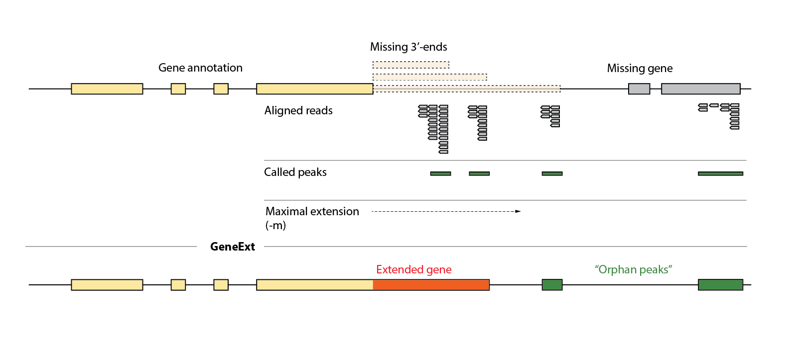
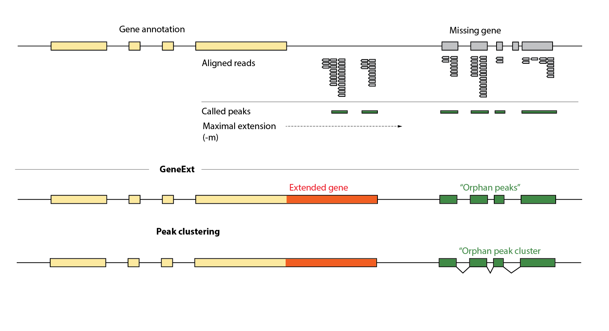

# Manual  

## Motivation   

Genomes often have incomplete annotations of their 3-prime untranslated regions (3'-UTRs). At the same time, some of the most popular single-cell RNA sequencing methods are biased towards 3' ends of mRNA molecules. In result, this creates a bias in gene counting for genes with missing fragments of 3'-UTRs:   


To mitigate this effect, `GeneExt` will try to extend the genes in your reference genome by __using the scRNA-seq dataset itself__ (or any 3'-biased type of transcriptomics data). This approach should increase the number of UMI counts registered per gene. In addition, `GeneExt` also fixes overlapping portions of genes. 

## How it works  


1. `GeneExt` is accepts alignment files of reads from any 3'-end biased single-cell or bulk RNA-seq protocol. It will then call peaks from this data using `macs2` software and will try to extend genes to the peaks located downstream. Alternatively, if you already have peaks you want to extend the genes to (e.g. somehow determined mRNA cleavage site coordinates), having `macs2` installed is not necessary. 
2. For every gene, the most downstream peak will be chosen as a new mRNA cleavage site. The maximal distance from a gene to a peak is controlled by an `-m` parameter (see below).  
3. After genes are extended, `GeneExt` will write an output file which can be used to build a genome reference (e.g. with `cellranger mkref`).  


## Input & Output   
To run `GeneExt`, you will need the following:  

1. scRNA-seq dataset mapped to the genome - `.bam` alignment file (vis ["Where do I get a .bam file?"](#how-to-get-a-bam-file))  
2. Genome annotation in the `gff` or `gtf` format  

`GeneExt` accepts following annotion input formats and converts them to the output:   
* `gff` &rarr; `gtf`  
* `gtf` &rarr; `gtf`  

In general, `GeneExt` will try to output a properly formatted `gtf` file that can be used as an input to `cellranger mkref`. However, since `gtf` files vary in their 9-th column attributes, this may not always be possible (vis [Input troubleshooting](#input-troubleshooting)).
Please, make sure your genome annotation file is properly formatted!   

## How to get a .bam file?   

If you already have used `cellranger`, then you can simply use its `.bam` file (`[OUTPUT]/outs/possorted_genome.bam`). Alternatively, you may generate an alignment yourself with any splice-aware aligner. 

Note: for now, `GeneExt` only accepths a single alignment file, so if you have multiple sequencing datasets, you should concatenate your scRNA-seq fastq file for the following step:  

```cat lane1.R2.fastq.gz lane2.R2.fastq.gz > data/cells.R2.fastq.gz```

Below is an example of how to generate such an alignment with `STAR` aligner:  

```bash
STARIDX=~/genomes/star_idx/ # path to the STAR index
GENOMEFA=~/genomes/genome.fa # path to genome sequence fasta file for genome index 

R2=data/cells.R2.fastq.gz # R2 reads from a 10x experiment 
NCPU=5 # number of cores to use for mapping 

# generate the genome index (skip if you already have a genome index)   
STAR --runMode genomeGenerate --runThreadN $NCPU --genomeDir $STARIDX --genomeFastaFiles $GENOMEFA

# run STAR alignment
STAR --genomeDir $STARIDX --outFilterMultimapNmax 10 --runThreadN $NCPU --readFilesIn $R2 --outFileNamePrefix cells --readFilesCommand zcat --outSAMtype BAM SortedByCoordinate --outSAMattributes Standard
```

Resulting `cellsAligned.sortedByCoord.out.bam` can be used as an input for the `GeneExt`.  

## BAM subsampling   

Sometimes, the dataset may be too large for `GeneExt` to run in meaninful time, you can subsample the `.bam` file to N reads using an option `--subsamplebam N`. This will significantly speed up the pipeline, but may come at a cost of missing some peaks.  

## Orphan peaks  

### Definition  

The majority peaks not be assigned to any gene due to the distance (`-m` parameter). However, some of these peaks will correspond to really long 3'-UTRs or __unannotated genes__: 



To capture cases like this, `GeneExt` provides an option to keep the peaks that pass coverage filtering but haven't been assigned to any gene (e.g. they are located too far from any genic region) with an `--orphan` option.  

__Note:__ it may happen that you will get a lot of "orphan" peaks in your annotation file  (e.g. 100 000). Don't worry, having these peaks in your genome annotation will not affect the counting. After you obtain a count matrix, you can always filter these peaks in the downstream analyses.    

### Merging orphan peaks   

Missing genes may be represented by multiple orphan peaks corresponding to exonic regions. Having such peaks will lead to including highly correlated features which is undesirable for single-cell RNAseq analyses. 
By default, `GeneExt` will try to merge such peaks by distance unless `--nomerge` is specified.  



Default settings are the following:  
* Maximum distance between the peaks (`--orphan_maxdist`) - 10000  
* Maximum size of the orphan peak cluster (`--orphan_maxsize`) - median gene length (genomic span)  

So far, the merged peaks are represented by a single continuos region.  

## Important parameters   

### --m Maximal extension length   

`-m` parameter specifies the maximum distance the gene is allowed to be extended for. Setting `-m` to larger values will almost always result in longer extensions of genes and thus more reads counted per gene.  
However, the genome annotation is guaranteed to be __missing some genes__. In such cases, you may actually __misassign the reads to the gene they don't belong to__.


Thus, instead of setting `-m` to unrealistically big values, we advice setting it to something biologically meaningful (e.g 1x-2x of median length of a gene) and to use it along with calling "orphan peaks" ( `--orphan` option, vis [Orphan peaks](#orphan-peaks)).


### --extension_mode Extension modes  

Depending on the application (or rather your taste), you may want to add extensions differently.  
Note: in general, it doesn't matter which type of extension you choose - it should not affect read counting.  


### --peakp Filtering peaks based on coverage  

To make `GeneExt` more conservative in peak calling, peaks are filtered based on the average coverage.   
After calling the peaks, `GeneExt` will calculate per-base coverage distribution for __genic__ peaks (i.e. peaks overlapping genes). This distribution is then used to filter __intergenic peaks__. `--peakp` sets a quantile of that distribution above which intergenic peaks are retained.  

   

Thus, decreasing `--peakp` will result in more peaks called and _vice versa_.   

## Input troubleshooting  

> "Properly formatted .gtf files are all alike; each bad .gtf is broken in its own way."
>
> Anna Karenina principle for genome annotation files

By far the most probable reason for `GeneExt` to fail are the problems with input annotation file. Below is a description of a minimal annotation file `GeneExt` can work with.  

Imagine a gene with a single transcript and 2 exons. A properly formatted minimal GFF file should look like the following:   
```
chr1  source  gene 1 100 .  + . ID=gene1;
chr1  source  transcript  1 100 . + . ID=transcript1;Parent=gene1
chr1  source  exon  1 40  . + . ID=exon1;Parent=transcript1
chr1  source  exon  70 100  . + . ID=exon1;Parent=transcript1    
```
GTF file is similar, but the 9-th column contains `gene_id` and  `transcript_id` attributes:   
```
chr1  source  gene 1 100 .  + . gene_id "gene1";
chr1  source  transcript  1 100 . + . gene_id "gene1"; transcript_id "transcript1"
chr1  source  exon  1 40  . + . gene_id "gene1"; transcript_id "transcript1"
chr1  source  exon  70 100  . + . gene_id "gene1"; transcript_id "transcript1"   
```

__TODO__
It is also possible to output a "mock" cellranger gtf file (`crgtf`) with only gene ranges labeled as exons. This file can also be accepted by `cellranger`.  

Notes:  
1. In `crgtf` file, every gene will be present as a single feature of a type "exon". This format disregards exon/intron structure of the genes which makes it unsuitable for downstream analyses which depend on this structure (e.g. RNA-velocity). 
2. If genes are provided in a `bed` file, then the output will always be the `crgtf` file.  
3. If you are really desperate, try converting your `.gff/.gtf` file into a `.bed` file with only genomic ranges. `GeneExt` will try to output `crgtf` file:
  ```
  chr1  1 100 gene1 0 +
  ```

## Adding missing "gene" features  

Quite often `.gtf/.gff` file will miss "gene" features. In such cases, `GeneExt` will try to fix the annotation by inferring genes.  
Note: currently, `transcript` features are not added automatically. Please, check if your annotation file at least contains exons and transcripts. 

# FAQs  

## GeneExt does not accept my annotation file  

see [Input troubleshooting](##Input-troubleshooting)

## GeneExt takes a long time to run. How can I speed it up?  

1. `.bam` subsampling:    
  By default, `GeneExt` will use the whole dataset to call the peaks. This may be computationally costly for big datasets (>50M reads). You can use `--subsamplebam 10000000` to randomly sample 10M reads (or any other amount). Keep in mind, __using more data is always better.__  
2. Use multiple threads with `-j` option.
2. Split your bam files by chromosomes:  
  You can split your genome into individual chromosomes / contigs and run `GeneExt` on each of them separately  

## I get hundreds of thoursands of peaks. How should I filter them?   

The results of peak calling depend on the  dataset quality. By default, `GeneExt` filters the peaks based on the coverage __before__ gene extension.  
However, as is stated above, having many "orphan" peaks in your annotation __will not affect gene counting__ but may help preserving valuable information about cell type heterogeneity in the data.    


## Some orphan peaks look like missing genes - how can I link them? 
For the specified peaks you want to merge, you can manually change the `gene.id` attribute in every peak to a common value (e.g. an 'unknown_gene_1'). If you observe a lot of such cases, you can try increasing parameters for orphan peak clustering and merging (`--orphan_maxdist`,`--orphan_size`).   
