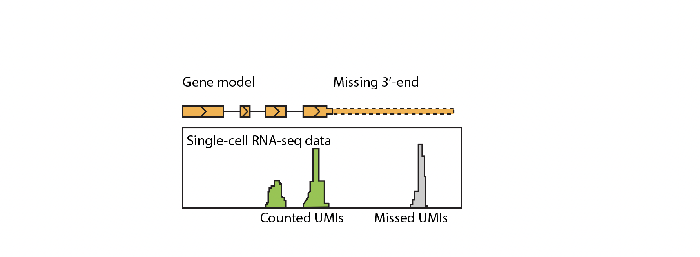
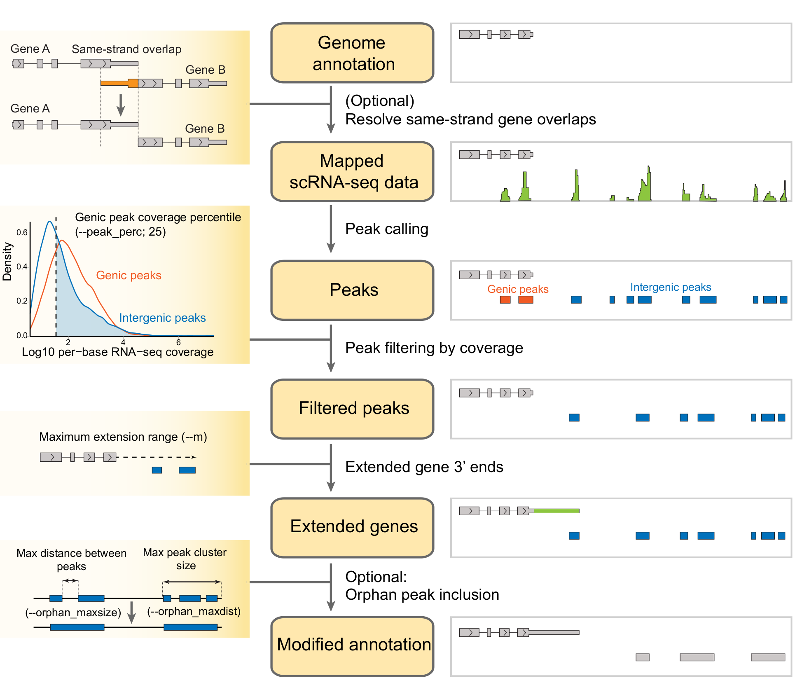
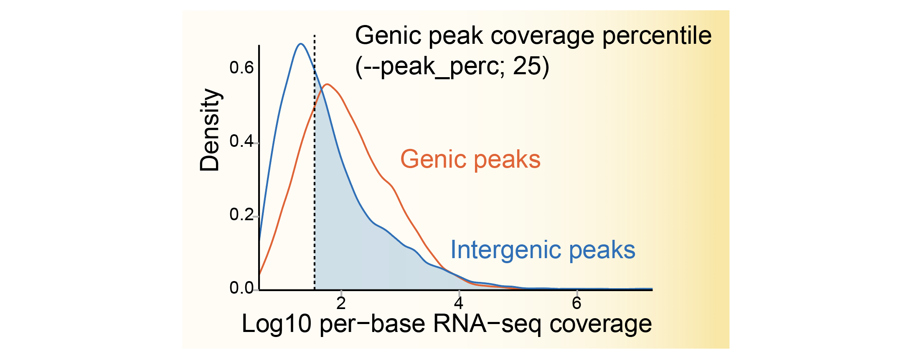

# GeneExt - Gene extension for improved single-cell RNA-seq data counting   

# Table of Contents
1. [Installation](#installation)
2. [Manual](#Manual)
3. [Tutorial](#Tutorial)
4. [FAQs](#faqs)

# Installation  

Dependencies:  
* `macs2`  - not needed if you already have the peaks  
* `bedtools`
* `samtools`
* python `gffutils`  
* python `numpy`  
* python `pysam`  


These dependencies can be installed with `conda`: 

```
# create environment
conda create -n geneext
conda activate genext
# install dependencies
conda install -c bioconda -c conda-forge gffutils bedtools numpy macs2 samtools pysam  
```


# TL;DR  Run
Once you have dependencies installed, you can try running `GeneExt`:  
```
python geneext.py -g [genome .bed/.gtf/.gff] -b [10x.bam] -m [maximal extension,bp] -o [output name]
```


# Manual  

## Motivation   

Non-model species often have incomplete annotations of their 3-prime untranslated regions (3'-UTRs). At the same time, some of the most popular single-cell RNA sequencing methods are biased towards 3' ends of mRNA molecules. In result, this creates a bias in gene counting for genes with missing 3'-UTRs:   


To mitigate this effect, `GeneExt` will try to extend the genes in your reference genome by __using the scRNA-seq dataset itself__ (or any 3'-biased type of transcriptomics data). This approach should increase the number of UMI counts registered per gene.  

## How it works  



1. `GeneExt` is supposed to accept alignment files of reads from any 3'-end biased single-cell or bulk RNA-seq protocol. It will then call peaks from this data using `macs2` software and will try to extend genes to the peaks downstream. Alternatively, if you already have peaks you want to extend the genes to (e.g. somehow determined mRNA cleavage site coordinates), having `macs2` installed is not necessary. 
2. For every gene, the most downstream peak will be chosen as a new mRNA cleavage site. The maximal distance from a gene to a peak is controlled by an `-m` parameter (see below).  
3. After genes are extended, `GeneExt` will write an a file which can be used to build a genome reference (e.g. with `cellranger mkref`).  


## Input & Output   

To run `GeneExt`, you will need the following:  

1. scRNA-seq dataset mapped to the genome - `.bam` alignment file (vis ["Where can I get a .bam file?"](#where-can-i-get-a-bam-file))  
2. Genome annotation in the `bed`, `gff` or `gtf` formats  

Note 1: in a `bed` file, only gene ranges should be present.  
Note 2: if using `.gff/.gtf` file, make sure there are "gene" features defined!  

`GeneExt` accepts following annotion input formats and converts them to the output:   
* `bed` &rarr; `crgtf`   __NOT IMPLEMENTED__
* `gff` &rarr; `gtf`  
* `gtf` &rarr; `gtf`  

In general, `GeneExt` will try to output a properly formatted `gtf` file that can be used as an input to `cellranger mkref`. However, since `gtf` files vary in their 9-th column attributes, this may not always be possible (vis [Input troubleshooting](#input-troubleshooting))   

## Where can I get a .bam file?   

If you already have used `cellranger`, then you can simply use its `.bam` file (`[OUTPUT]/outs/possorted_genome.bam`). Alternatively, you may generate an alignment yourself with any splice-aware aligner. 

Note: for now, `GeneExt` only accepths a single alignment file, so if you have multiple sequencing datasets, you should concatenate your scRNA-seq fastq file for the following step:  

```cat lane1.R2.fastq.gz lane2.R2.fastq.gz > data/cells.R2.fastq.gz```

Below is an example of how to generate such an alignment with `STAR` aligner:  

```bash
STARIDX=~/genomes/star_idx/ # path to the STAR index
GENOMEFA=~/genomes/genome.fa # path to genome sequence fasta file for genome index 

R2=data/cells.R2.fastq.gz # R2 reads from a 10x experiment 
NCPU=5 # number of cores to use for mapping 

# generate the genome index (skip if you already have a genome index)   
STAR --runMode genomeGenerate --runThreadN $NCPU --genomeDir $STARIDX --genomeFastaFiles $GENOMEFA

# run STAR alignment
STAR --genomeDir $STARIDX --outFilterMultimapNmax 10 --runThreadN $NCPU --readFilesIn $R2 --outFileNamePrefix cells --readFilesCommand zcat --outSAMtype BAM SortedByCoordinate --outSAMattributes Standard
```

Resulting `cellsAligned.sortedByCoord.out.bam` can be used as an input for the `GeneExt`.  

## BAM subsampling   

If your 10x dataset is too big for `GeneExt` to run in meaninful time, you can subsample the `.bam` file to N reads using an option `--subsamplebam N`. This will significantly speed up the pipeline, but may come at a cost of missing some genes.   


## Important parameters   

### --m Maximal extension length   

`-m` parameter specifies the maximum distance the gene is allowed to be extended for. Setting `-m` to larger values will almost always result in longer extensions of genes and thus more reads counted per gene.  
However, the genome annotation will surely __miss some genes__. In such cases, you may actually __misassign the reads to the gene they don't belong to__.


Thus, instead of setting `-m` to unrealistically big values, we advice setting it to something biologically meaningful (e.g 1x-2x of median length of a gene) and to use it along with calling "orphan peaks" ( `--orphan` option, vis "What are the orphan peaks?").

### --extension_mode Extension modes  

Depending on the application (or rather your taste), you may want to add extensions differently.  
Currently, the following modes are available:   
* `new_transcript`  
* `new_exon`  


Note: in general, it doesn't matter which type of extension you choose - it should not affect read counting.  

### --peakp Filtering peaks based on coverage  

To make `GeneExt` more conservative in peak calling, peaks are filtered based on the average coverage.   
After calling the peaks, `GeneExt` will calculate per-base coverage distribution for __genic__ peaks (i.e. peaks overlapping genes). This distribution is then used to filter __intergenic peaks__. `--peakp` sets a quantile of that distribution above which intergenic peaks are retained.  

   

Thus, decreasing `--peakp` will result in more peaks called and _vice versa_.   

### --orphan What are the "orphan peaks"?  

The majority peaks not be assigned to any gene due to the distance (`-m` parameter). However, some of these peaks will correspond to really long 3'-UTRs or __unannotated genes__: 


To capture cases like this, `GeneExt` provides an option to keep the peaks that haven't been assigned to any gene ("orphan").  
__Note:__ it may happen that you will get a lot of "orphan" peaks in your annotation file  (e.g. 100 000). Don't worry, having these peaks in your genome annotation will not affect the counting.
After you obtain a count matrix, you can always filter these peaks based on their size and expression level.    

# Tutorial  

## Running GeneExt  

Try executing the tool with the sample data:  

```python geneext.py -g sample/genome_sample.gtf -b sample/sample_10x.bam -m 10000 -o genome_extended.gtf```

Note, here `-m` option specifies the maximal distance to which a gene is allowed to be extended (10kb in this case).   
If the program finishes without an aardvark showing up, you will find the resulting annotation `genome_extended.gtf` along with a temporary directory (`tmp/` by default) which stores intermediate files useful for debugging.  

Now, you can also try running the tool with an `--orphan` setting:

```python geneext.py -g sample/genome_sample.gtf -b sample/sample_10x.bam -m 10000 --orphan -o genome_extended_orphan.gtf```

## Starting from peaks   

If you already know coordinates of mRNA 3' ends (e.g. you have a 3P-seq or FLAM-seq data or similar), you can skip peak calling step above and use `GeneExt` to simply assign the peaks to the genes:  


```python geneext.py -g sample/genome_sample.gtf -p sample/sample_peaks.bed -m 10000 --orphan -o genome_extended_orphan.gtf```  

As in previous case, executing with `--orphan`  will result in addition of the unassigned peaks to the final genome annotation.  


## Output files   

By default, `GeneExt` will output an annotation file (`-o`) and a temporary directory (`-t`) with intermediate files useful for debugging.  

## Understanding the report   

Report PDF file provides some basic information about the distributions in the data.   
By far, the most important plot is the distribution of the distances to the closest peak ("Distance to the nearest non−genic peak").  
A peak in this distribution provides an estimate of a general length of missing 3' ends across the whole genome.  
You can compare this distribution with the distribution of introduced gene extensions to see whether it makes sense to decrease a maximum allowed extension per gene.   


## Help   

If you have problems with running `GeneExt`, please, raise an issue in this directory or drop an email to `gzolotarov@crg.es`.


# Input troubleshooting  

> "All properly formatted .gtf files are all alike; each bad .gtf is broken in its own way."
>
> Anna Karenina principle for genome annotation files

By far the most probable reason for `GeneExt` to fail are the problems with input annotation file. Below is a description of a minimal annotation file `GeneExt` can work with.   
Imagine a gene with a single transcript and 2 exons. A properly formatted minimal GFF file should look like the following:   
```
chr1  source  gene 1 100 .  + . ID=gene1;
chr1  source  transcript  1 100 . + . ID=transcript1;Parent=gene1
chr1  source  exon  1 40  . + . ID=exon1;Parent=transcript1
chr1  source  exon  70 100  . + . ID=exon1;Parent=transcript1    
```
GTF file is similar, but the 9-th column contains `gene_id` and  `transcript_id` attributes:   
```
chr1  source  gene 1 100 .  + . gene_id "gene1";
chr1  source  transcript  1 100 . + . gene_id "gene1"; transcript_id "transcript1"
chr1  source  exon  1 40  . + . gene_id "gene1"; transcript_id "transcript1"
chr1  source  exon  70 100  . + . gene_id "gene1"; transcript_id "transcript1"   
```

It is also possible to output a "mock" cellranger gtf file (`crgtf`) with only gene ranges labeled as exons. This file can also be accepted by `cellranger`.  

Notes:  
1. In `crgtf` file, every gene will be present as a single feature of a type "exon". This format disregards exon/intron structure of the genes which makes it unsuitable for downstream analyses which depend on this structure (e.g. RNA-velocity). 
2. If genes are provided in a `bed` file, then the output will always be the `crgtf` file.  
3. If you are really desperate, try converting your `.gff/.gtf` file into a `.bed` file with only genomic ranges. `GeneExt` will try to output `crgtf` file:


```
chr1  1 100 gene1 0 +
```


# FAQs  

## GeneExt does not accept my annotation 

see [Input debugging](#input-troubleshooting)

## GeneExt takes ages to run. How can I speed it up?  

1. `.bam` subsampling:    
  By default, `GeneExt` will use the whole dataset to call the peaks. This may be computationally costly for big datasets (>50M reads). You can use `--subsamplebam 10000000` to randomly sample 10M reads (or any other amount). Keep in mind, __using more data is always better.__  
2. Parallelization:  
  You can split your genome into individual chromosomes / contigs and run `GeneExt` on each of them separately  

## I get too many orphan peaks. How should I filter them?   

The results of peak calling depend on the  dataset quality. `GeneExt` allows to select peaks based on the coverage __before__ gene extension.  
However, as is stated above, having many "orphan" peaks in your annotation __will not affect gene counting__. You can filter the peaks in the downstream analyses by expression.  


## Some orphan peaks look like missing genes - how can I link them?   

For the specified peaks you want to merge, you can manually change the `gene.id` attribute in every peak to a common value (e.g. an 'unknown_gene_1').    


# TODOs:
- [x] coverage filtering for the peaks  
  - how to filter the peaks? - so far, by coverage  
- [x] solve the problem with non-unique orphan peak naming  
- [x] proper input/output parsing   
- [x] peak coverage distributions check  
   - results are not clear
- [x] add man orphan peaks  
- [x] add description of the output files    
- [x] default max size - gene median length  
- [x] speedup coverage computation? 
- [x] .bam file subsampling to a manageable amount of reads 
- [x] verbosity 1: simple output; verbosity 2 : a lot of output  
- [x] filering based on the GENE-OVERLAPPING peaks!
- [x] filtering by the mean coverage     
- [x] Add reporting:   
  - [x] distance from the closest peaks  
- [x] update the function guessing the extension     
- [x] remove big temporary files nog `--debug`  
- [x] input gff -> output gtf  
- [x] solve `bedtools coverage` RAM problem for large datasets: replace with `pysam`   
- [ ] check whether read fraction for subsampling works properly  
- [ ] fix report path error when called outside of the directory   
- [ ] `helper.add_orphan` should be split into getting the orphan peaks and adding them to allow for peak merging later on  
- [ ] no report if there is no alignmnet     
- [ ] add log file  
- [ ] __check extension modes__  
- [ ] __check performance__   
- [ ] skip peak filtering if not required  
- [ ] add peak filtering manual        
- [ ] try out `gffread` standardized output files, make sure it's comptabible (can be accepted by genext)   
- [ ] add post-extension orphan peak filtering?      
- [ ] make sure cellranger accepts the file with orphan peaks  
- [ ] to output `crgtf` files for bed inputs  
- [ ] __cellranger mock gtf__ - figure the minimal requirements the cellranger has for gtf   
- [ ] estimated intergenic mapping proportion? - count the reads with samtools   
- [ ] orphan peak linkage:
  - [ ] simple distance merging     
  - [ ] splice junctions if a splice junctions file is provided  
